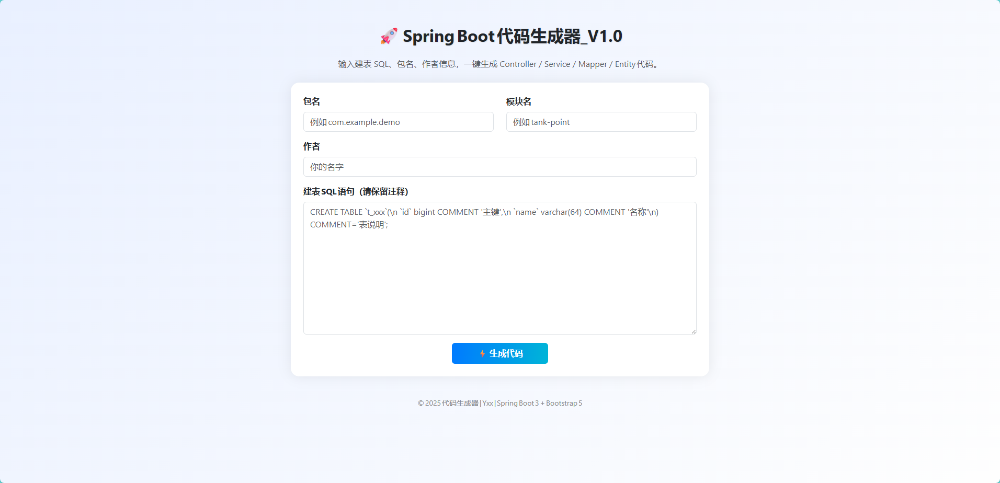

```markdown
# 🚀 SpringBoot Code Generator

一个基于 **Spring Boot 3 + JDK 17 + Swagger + MyBatis‑Plus + Freemarker + EasyExcel + Bootstrap** 的通用代码生成器。  
通过在网页中输入建表 SQL （含注释）、包名、模块名、作者信息，即可一键生成完整的后端业务代码。

---

## ✨ 功能特性

- 🧱 一键生成 Controller / Service / ServiceImpl / Mapper / Mapper.xml / Entity / BO / VO / QueryVO  
- 📝 自动识别表注释、字段注释、字段类型并映射到 Java 类型  
- 🚀 支持 Swagger 注解（OpenAPI 3） & Lombok 自动 getter/setter  
- 💡 支持 EasyExcel 导入导出结构（可自行扩展）  
- 💻 自带 Bootstrap 网页界面，自动打包 ZIP 供下载  
- 🧩 支持 MyBatis‑Plus，通用 BaseMapper 和分页封装  
- ☕ 兼容 JDK 17 及 Spring Boot 3 以上版本  

---

## 🧰 技术栈

| 模块 | 技术 |
|------|------|
| 核心框架 | Spring Boot 3.2 + JDK 17 |
| ORM | MyBatis‑Plus 3.5.6 |
| 模板引擎 | Freemarker |
| 文档 | Swagger (springdoc‑openapi) |
| Excel | EasyExcel 3.3.2 |
| 前端页面 | Bootstrap 5 + jQuery |
| 构建工具 | Maven |

---

## 📂 项目结构
code-generator
├── pom.xml
├── src
│   ├── main
│   │   ├── java/com/example/generator
│   │   │   ├── CodeGeneratorApplication.java
│   │   │   ├── controller/GeneratorController.java
│   │   │   ├── service/GeneratorService.java
│   │   │   ├── service/impl/GeneratorServiceImpl.java
│   │   │   ├── model/{TableInfo,ColumnInfo,GeneratorRequest}.java
│   │   │   └── util/{SqlParseUtils,TemplateRenderUtils}.java
│   │   └── resources
│   │       ├── application.yml
│   │       ├── static/index.html
│   │       └── templates/
│   │           ├── controller.ftl
│   │           ├── service.ftl
│   │           ├── serviceImpl.ftl
│   │           ├── mapper.ftl
│   │           ├── mapperXml.ftl
│   │           ├── entity.ftl
│   │           ├── vo.ftl
│   │           ├── bo.ftl
│   │           └── queryVO.ftl

生成后的 ZIP 包中会包含：
controller/
service/
service/impl/
mapper/
mapperXml/
dataobject/entity/
dataobject/vo/
dataobject/bo/
```

生成后的 ZIP 包中会包含：
```
controller/
service/
service/impl/
mapper/
mapperXml/
dataobject/entity/
dataobject/vo/
dataobject/bo/
```

---

## 🖥️ 使用步骤

1. **克隆代码并构建**
   ```bash
   git clone https://github.com/yourname/code-generator.git
   cd code-generator
   mvn clean package
   ```

2. **启动项目**
   ```bash
   mvn spring-boot:run
   ```

3. **打开网页**
   浏览器访问 👉 [http://localhost:8080/index.html](http://localhost:8080/index.html)

4. **输入参数并生成**
    - 包名：`com.example.demo`
    - 模块名：`tank-point`
    - 作者：`Your Name`
    - 建表 SQL：
      ```sql
      CREATE TABLE `t_tank_point` (
        `id` bigint(20) NOT NULL COMMENT '主键',
        `name` varchar(64) COMMENT '名称',
        `capacity` decimal(10,2) COMMENT '容积',
        `create_time` datetime COMMENT '创建时间'
      ) COMMENT='点位信息表';
      ```
   点击 **「生成代码」** ，自动下载 `generated-code.zip`。

5. **解压并导入**
   将解压后的文件复制到你自己的 Spring Boot 工程内，即可直接编译运行。

---

## 🖼️ 页面预览

（可在运行项目后访问首页自动生成）



---

## ⚙️ 配置说明

主要配置位于 `src/main/resources/application.yml`：

```yaml
server:
  port: 8080
spring:
  freemarker:
    template-loader-path: classpath:/templates/
    charset: UTF-8
springdoc:
  swagger-ui:
    path: /swagger-ui.html
```

Swagger 文档访问地址:  
👉 [http://localhost:8080/swagger-ui.html](http://localhost:8080/swagger-ui.html)

---

## 🧩 自定义模板

模板位于 `resources/templates/` 下，采用 Freemarker 语法。  
你可以根据自己的项目规范调整：

- 包路径和文件命名
- Swagger 注解内容
- 是否添加 EasyExcel 注解
- 生成前端视图模型结构等

---

## 🧠 未来可扩展方向

- 🔧 数据库连接 → 自动读取 表结构元数据信息，无需手写 SQL
- 🧮 多模块模板支持（Controller + JPA / DTO / Mapper 映射）
- 💻 生成前端 React/Vue 基础页面
- 🧰 结合代码审查规范（统一命名、统一注释）

---

## 📜 许可与声明

仅供个人学习与内部开发使用，请遵守相关开源协议与法律法规。  
如需商用或二次封装，请注明出处。

---

## 👨‍💻 作者

**${author}**  
📅 项目创建日期：${date}  
📫 如果对本项目有任何建议或改进想法，欢迎提交 Issues 或 PR！

---

🧡 **希望这个小工具能帮你快速搭建高质量的 Spring Boot 源码模板！**
```

---

这份 README.md 放在你项目根目录即可 (`code-generator/README.md`)，  
在 GitHub 或 Gitee 中都能很好地展示（标题、表格、代码块、截图等都有格式）。  

是否希望我帮你把开头 logo/banner 或者中英双语版 README 也一并准备好？